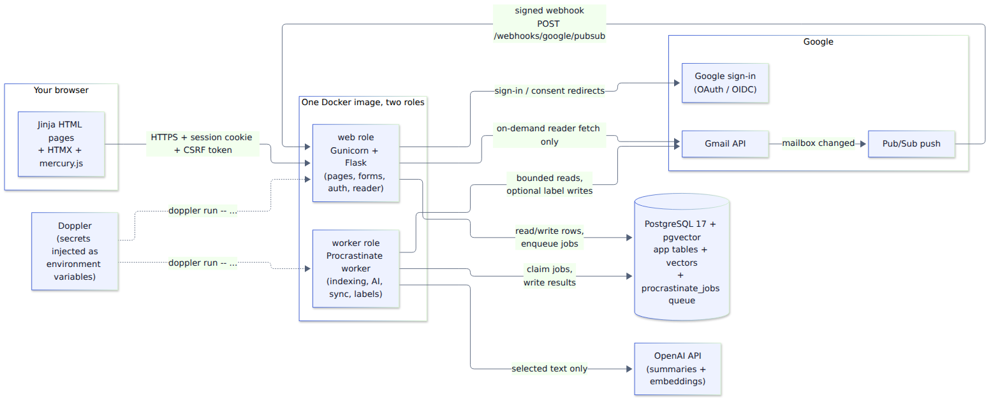

# 1. What Mercury is, and the stack

## The product in one paragraph

Mercury turns a noisy Gmail inbox into a calm workspace **without replacing Gmail**. You sign in
with Google, read a plain-language disclosure, and connect Gmail with read-only access. Mercury
then indexes up to 2,000 recently active conversations from the last six months. It stores
**metadata** (sender, subject, dates, labels) and **derived data** (a one-sentence AI summary, a
possible action, a numeric "embedding" used for grouping). It does **not** store message bodies.
When you open a conversation, Mercury fetches the original text from Gmail right then, shows it as
safe plain text, and throws it away after the request. To reply or open an attachment, you click
**Open in Gmail**.

What Mercury deliberately does **not** do: send or draft mail, download attachments, delete,
trash or archive Gmail messages, billing, chat, or a browser extension.

## The stack, layer by layer

| Layer | Technology | What it does in Mercury | Why this choice |
|---|---|---|---|
| Language | **Python 3.12** | Everything server-side | Familiar; strong libraries for Google, OpenAI, ML |
| Web framework | **Flask 3.1** | Routes, requests, sessions | Small and explicit; an *application factory* (`create_app()`) lets tests build isolated app instances |
| Templates | **Jinja2** | Builds the HTML pages on the server | Comes with Flask; **auto-escapes** values, which blocks script injection from email content |
| Partial page updates | **HTMX 2.0.11** | Swaps server-rendered HTML fragments into the page (reader panel, progress polling, action buttons) | Gives an app-like feel with no separate JavaScript frontend or JSON API |
| Styling | **Bootstrap 5.3.8** CSS + `mercury.css` | Base components, plus Mercury's own "Quicksilver" design system | Accessible defaults; Mercury's stylesheet adds the theme and dark mode |
| Browser JS | `mercury.js` (vanilla) | Keyboard shortcuts, bulk select, dialogs, theme toggle, CSRF header for HTMX | One small file; no build tools needed |
| Forms & CSRF | **Flask-WTF / WTForms** | Validates form input; requires a CSRF token on every state-changing request | Stops other websites from submitting forms as you |
| Login sessions | **Flask-Login** | Remembers who is signed in | Standard Flask session handling |
| Google sign-in | **Authlib** | OAuth 2.0 / OpenID Connect with state, nonce, PKCE | Don't hand-roll security protocols |
| Gmail access | **google-api-python-client + google-auth** | Lists threads, fetches messages, history sync, watch, labels | Google's maintained client libraries |
| Database | **PostgreSQL 17** | All persistent data | One reliable store for everything |
| Vectors | **pgvector 0.8.2** | Stores 512-number embeddings per thread | No separate vector database to run or pay for |
| ORM & migrations | **SQLAlchemy 2** (via Flask-SQLAlchemy) + **Alembic** (via Flask-Migrate) | Python classes ↔ tables; versioned schema changes | Standard, reviewable migrations in `migrations/versions/` |
| Background jobs | **Procrastinate 3.9** | Job queue stored **in PostgreSQL**; the worker process runs jobs | Retries, locks, periodic tasks, and crash recovery without adding Redis |
| AI | **OpenAI SDK** | `gpt-4.1-mini` summaries (structured output) + `text-embedding-3-small` (512-dimension) embeddings | One provider behind a small adapter; a fake adapter for offline use |
| Grouping math | **NumPy + scikit-learn** | PCA + HDBSCAN clustering helpers | CPU-only, runs in the worker (currently not wired into a job; see README) |
| HTML → text | **Beautiful Soup** | Turns HTML-only emails into plain text for the reader | Never renders untrusted email HTML |
| Encryption | **cryptography** (Fernet/MultiFernet) | Encrypts stored Google tokens; supports key rotation | Audited library; no home-made crypto |
| Admin | **Flask-Admin** | A read-only operations page (counts and run statuses) | Explicitly *no* mailbox-reading interface |
| Web server | **Gunicorn** | Runs Flask in production (2 workers × 2 threads) | Flask's built-in server is for development only |
| Packaging | **Poetry 2.4** | Dependency management with a lock file (`poetry.lock`) | Everyone installs exactly the same versions |
| Containers | **Docker + Docker Compose** | One image; local stack of db + web + worker | "Works on my machine" becomes "works everywhere" (see chapter 5) |
| Secrets | **Doppler** | Injects secrets as environment variables at start-up | No secrets in files, images, or Git |
| Hosting | **Azure Container Apps + Azure PostgreSQL Flexible Server + Azure Container Registry** | Production target | One managed platform; same image as local |
| CI/CD | **GitHub Actions** | Lint, tests, security scans, container scan, manual deploy | Runs on every push |
| Quality tools | **pytest, pytest-socket, Playwright, ruff, bandit, pip-audit, gitleaks, Trivy** | Tests (network blocked), browser test, lint/format, security lint, dependency CVEs, secret scan, image scan | Automated safety net |

## Runtime architecture

How to read it:

- **Browser → web.** Every page and every button click goes to the Flask **web** process. The
  browser sends a session cookie (who you are) and a CSRF token (proof the click came from
  Mercury's own page).
- **web → PostgreSQL.** The web process reads and writes rows. For slow work it doesn't do the work
  itself; it writes a small **job** row into the queue table (`procrastinate_jobs`) and returns
  immediately.
- **worker → PostgreSQL.** The **worker** process watches the queue, claims jobs, and writes
  results back. Web and worker never talk to each other directly; the database is the meeting point.
- **Gmail.** The worker does the bulk reading (indexing, sync). The web process calls Gmail in
  exactly one case: when you open a message, it fetches that thread's text on demand.
- **OpenAI.** Only the worker calls OpenAI, and only with selected text from threads whose owner
  consented to AI processing.
- **Pub/Sub.** In production, Gmail tells Google Pub/Sub "this mailbox changed", and Pub/Sub calls
  Mercury's webhook with a signed token. Mercury marks the account as needing sync and queues a job.
- **Doppler.** In production, the container's start-up script runs `doppler run -- <command>`,
  which fetches secrets and passes them to the app as environment variables. If Doppler can't be
  reached, the container refuses to start (it "fails closed").

## Three modes: demo, real development, production

The same code runs in all three; environment variables choose real or fake providers.

| Setting | `make demo` (synthetic) | Real-account development | Production |
|---|---|---|---|
| `APP_ENV` | `development` | `development` | `production` |
| `AUTH_MODE` | `dev` (demo login button) | `google` | `google` (enforced) |
| `MAIL_MODE` | `fake` (invented mailbox) | `gmail` | `gmail` (enforced) |
| `AI_PROVIDER` | `fake` (deterministic) | `openai` or `fake` | `openai` (enforced) |
| `SYNC_MODE` | `manual` | `manual` or `poll` | `poll` or `push` (enforced) |
| Secrets come from | Built-in, clearly fake dev keys | Doppler `dev` config | Doppler `prd` config |

`mercury/config.py` validates these combinations at start-up. Production refuses to boot with
fake providers, debug mode, HTTP, weak cookies, demo keys, or a database without verified TLS.
