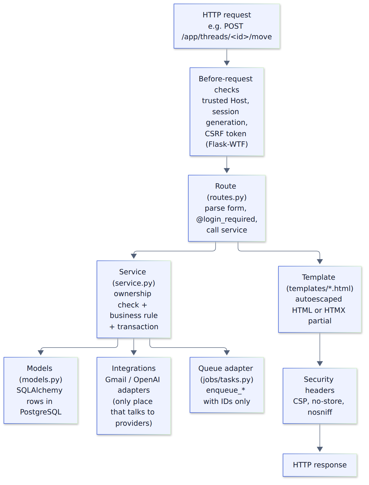

# 2. How the code is organized

## The folder map

```text
mercury/                       ← the Python package (the app itself)
  __init__.py                  create_app(): builds and wires the Flask app
  config.py                    reads + validates environment variables (the ONLY place that does)
  extensions.py                db, migrate, login_manager, csrf, oauth (created unbound)
  commands.py                  `flask ...` CLI: seed-demo, queue-schema, promote-admin, rotate keys, deletion replay
  accounts/                    users, Gmail connection, login, settings, disconnect/delete
  inbox/                       threads, message refs, analyses, embeddings, runs; workspace + reader
    reader.py                  turns a fetched Gmail thread into safe plain text (never stored)
    sync.py                    incremental Gmail history sync + per-account lock
  buckets/                     buckets, assignments, sender rules, label mappings; move/merge/rename
    clustering.py              PCA + HDBSCAN math (pure functions)
  intelligence/                AI orchestration, prompts, output schema, budget accounting
  integrations/                the ONLY code that talks to outside services
    google/                    oauth.py, gmail.py, notifications.py (Pub/Sub), labels.py, links.py
    ai/                        openai.py (real) and fake.py (offline)
    fake_gmail.py              the invented demo mailbox
    types.py                   provider-neutral data classes + error types
  jobs/                        queue adapter (queue.py), task wrappers (tasks.py), worker entry (worker.py, cli.py)
  security/                    crypto.py (token encryption), headers.py (CSP, no-store, request IDs)
  admin/                       read-only operations dashboard
  public/                      landing, privacy, terms, help, health checks
  templates/                   Jinja HTML (base, components, inbox, buckets, accounts, public, errors, admin)
  static/                      css/, js/, img/, vendor/ (Bootstrap + HTMX files, checked in)
migrations/versions/           Alembic migration scripts (the schema history)
tests/                         unit/, integration/, security/, acceptance/, browser/
deploy/                        Dockerfile, compose.yaml, entrypoint.sh, gunicorn.conf.py, azure/*.bicep
.github/workflows/             ci.yml (every push), deploy.yml (manual)
docs/                          architecture, security, operations, google-review
scripts/fetch_vendor_assets.py downloads + hash-checks Bootstrap/HTMX
Makefile                       the command menu (chapter 6)
pyproject.toml / poetry.lock   dependencies
wsgi.py                        `app = create_app()`, what Gunicorn and `flask --app wsgi:app` load
```

Each feature folder (`accounts/`, `inbox/`, `buckets/`, `intelligence/`) usually has the same
three files:

| File | Job | Rule |
|---|---|---|
| `models.py` | Defines tables as Python classes | Describes data and constraints, no business logic |
| `routes.py` | HTTP endpoints (a Flask **blueprint**) | Parse input, check login, call a service, render a template. Kept thin. |
| `service.py` | Business rules and transactions | Every function takes the owner's `user_id` and filters by it |

## The life of a request



Example: you move a thread to the "Finance" bucket.

1. The browser sends `POST /app/threads/<thread-id>/move` with `bucket_id` and a CSRF token.
2. Before any route runs, Flask checks the Host header against the trusted hosts list, CSRF checks
   the token, and Mercury checks your session is still valid (`session_generation` matches).
3. `inbox/routes.py::move` validates the form and calls `buckets/service.py::move_thread(user_id,
   thread_id, bucket_id)`.
4. The service loads the thread **and** the bucket, both filtered by your `user_id`. If either
   belongs to someone else, it behaves as "not found". It updates the `BucketAssignment`, sets
   `origin="user"` and `locked_by_user=True` (so future automation won't move it back), and commits.
5. If Gmail label sync is enabled, it queues an `apply_owned_label` job.
6. The route responds: a redirect for a normal form post, or a small HTML fragment plus a toast
   message for an HTMX request.
7. `security/headers.py` adds security headers (CSP, `Cache-Control: no-store`, etc.) to every response.

## Where is…? (questions the spec says the repo must answer)

| Question | Answer |
|---|---|
| Where is Gmail synchronization? | Initial indexing: `inbox/service.py::index_account`. Incremental: `inbox/sync.py::sync_account_history`. Scheduling: `jobs/tasks.py` |
| Where are buckets created? | By you: `buckets/service.py::create_bucket`. Demo: `seed_demo_buckets`. Automatic suggestions: not wired yet (see README) |
| Where is email content rendered? | Fetch: `inbox/routes.py::thread_body` → `inbox/reader.py::build_thread_view` → `templates/inbox/body.html` (escaped plain text) |
| Where are secrets loaded? | `config.py::load_config` reads environment variables; Doppler injects them (`deploy/entrypoint.sh`) |
| What happens when a worker crashes? | The job's heartbeat stops; `retry_stalled_jobs` re-queues it within ~2 minutes (chapter 8) |
| How are other users' records kept inaccessible? | Every query filters by `user_id`; composite foreign keys stop cross-user links; tests in `tests/security/` |
| How do I run locally and deploy the same image? | `make demo` locally; `.github/workflows/deploy.yml` builds once in Azure Container Registry and deploys that exact digest |

## Endpoints

| Method + path | Purpose |
|---|---|
| `GET /`, `/privacy`, `/terms`, `/help` | Public pages |
| `GET /health/live`, `/health/ready` | Liveness (no DB) and readiness (DB + schema) probes |
| `GET/POST /auth/dev` | Synthetic demo login (404 outside dev mode) |
| `POST /auth/google/start`, `GET /auth/google/callback` | Google sign-in |
| `GET /auth/gmail/connect`, `POST /auth/gmail/start`, `GET /auth/gmail/callback` | Disclosure page and Gmail connection |
| `POST /auth/logout` | Sign out |
| `GET /app` (`?view=overview|attention|all|unsorted`) | Workspace |
| `GET /app/buckets/<id>` | Workspace filtered to one bucket |
| `GET /app/threads/<id>` | Reader shell (summary, actions, bucket) |
| `GET /app/threads/<id>/body` | Original message text fetched from Gmail on demand |
| `POST /app/threads/<id>/move` | Move to a bucket (locks the choice) |
| `POST /app/threads/<id>/action` | Handled / Not an action / Reopen (Mercury-only) |
| `POST /app/sync` | Request a re-index |
| `GET /app/runs/<id>` | Processing progress |
| `GET/POST /app/buckets/new`, `/<id>/edit`, `/<id>/merge`; `POST /<id>/archive` | Bucket management |
| `GET/POST /app/rules` | Exact-sender rules |
| `GET /settings`; `POST /settings/labels`, `/settings/disconnect`, `/settings/delete` | Settings |
| `POST /webhooks/google/pubsub` | Gmail change notifications (signed JWT; the only CSRF exemption) |
| `/admin/` | Operations metrics (admins only; 404 for everyone else) |
