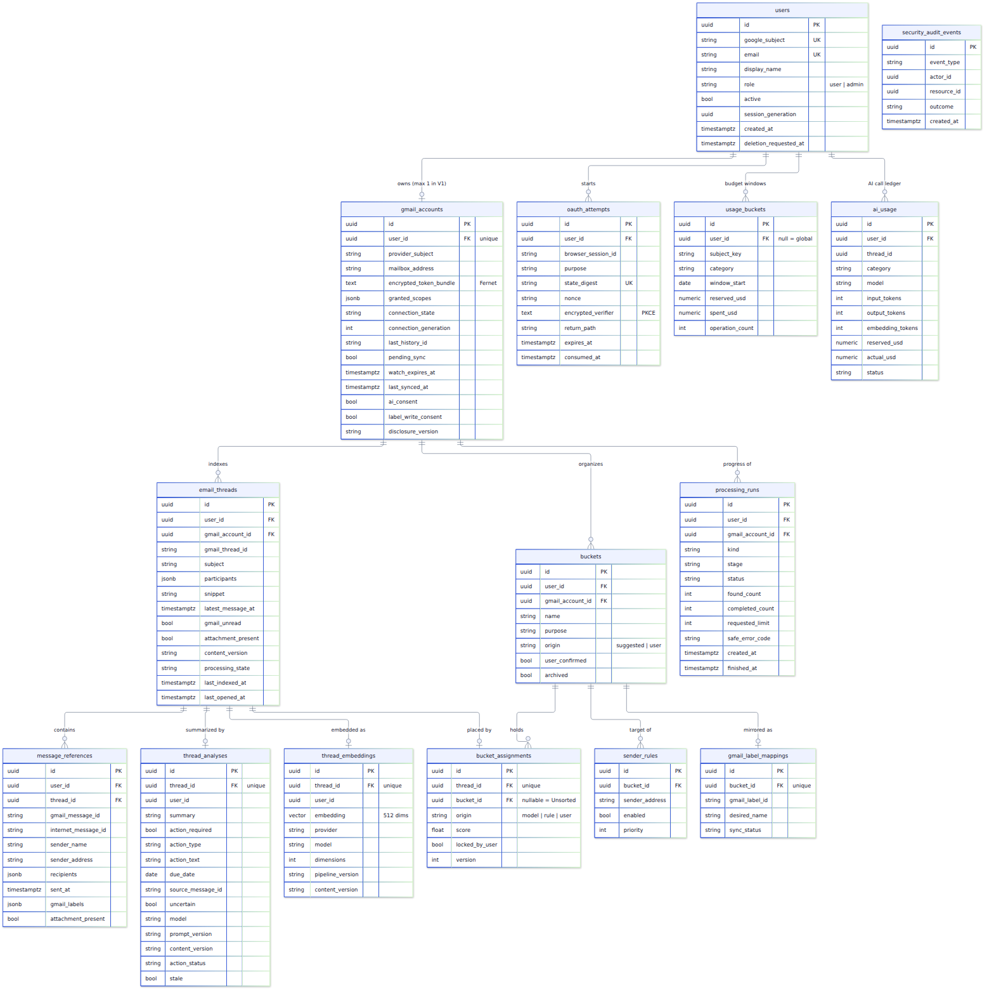

# 3. Database tables

Mercury has **14 application tables** in PostgreSQL, plus the tables Procrastinate creates for its
job queue. The full diagram is below; each table is then described with why it exists and what
its fields track.

## Conventions used by every table

- **`id` is a UUID**, a random 128-bit identifier such as `c93d8288-4a8c-...`. Random IDs don't
  reveal how many rows exist, but Mercury never relies on them being secret; every lookup also
  checks ownership.
- **Every mailbox-derived row carries `user_id`** (and usually `gmail_account_id`). Every query
  filters by it. This is the core of tenant isolation.
- **Composite foreign keys.** For example, `email_threads (gmail_account_id, user_id)` must match
  a real `gmail_accounts (id, user_id)` pair. The database itself therefore rejects a row that
  links your thread to someone else's account or bucket, even if application code had a bug.
- **`ON DELETE CASCADE`.** Deleting a user or a Gmail account automatically deletes everything
  derived from it. This is how disconnect and account deletion remove data.
- **Timestamps are timezone-aware UTC** (`timestamptz`).
- **Gmail identifiers** (`gmail_thread_id`, `gmail_message_id`, `last_history_id`) are external
  references stored as strings. They are never used to decide who may see something.
- **No message bodies anywhere.** No column holds a body, raw MIME, attachment, OAuth plaintext,
  or AI prompt. Tests seed a secret marker string in fixture bodies and assert it never reaches
  the database or queue.

---

## Accounts area (`mercury/accounts/models.py`)

### `users`
**Why:** one row per Mercury user: identity, role, and the switch that invalidates old sessions.

| Field | Tracks |
|---|---|
| `id` | Internal UUID |
| `google_subject` | Google's permanent account ID (`sub`), unique. Identifies the person even if their email changes |
| `email` | Verified email address (display and contact; not the identity) |
| `display_name` | Name shown in the UI |
| `role` | `user` or `admin`. Admin is only granted via `flask promote-admin <email>` |
| `active` | False blocks all access immediately |
| `session_generation` | Random UUID copied into your session cookie. Changing it (disconnect, delete) logs out every existing session |
| `created_at` | Sign-up time |
| `deletion_requested_at` | When deletion was requested (set just before the row is removed) |

### `gmail_accounts`
**Why:** the one Gmail mailbox connected to a user: its encrypted credentials, consent choices,
and synchronization bookmark.

| Field | Tracks |
|---|---|
| `id` | Internal UUID |
| `user_id` | Owner (unique: one Gmail account per user in V1) |
| `provider_subject` | Google subject of the mailbox (must match the signed-in user) |
| `mailbox_address` | The Gmail address, used to match incoming Pub/Sub notifications |
| `encrypted_token_bundle` | Google access + refresh tokens, **Fernet-encrypted**; cleared on disconnect |
| `granted_scopes` | Which permissions Google actually granted (e.g. `gmail.readonly`, optionally `gmail.modify`) |
| `connection_state` | `connected`, `reconnect_required` (grant revoked/expired), `deleting` |
| `connection_generation` | Counter bumped on disconnect/reconnect. Jobs carry the number they were created with and do nothing if it changed, so old work can't resurrect deleted data |
| `last_history_id` | Gmail's history checkpoint: "I have processed everything up to here" |
| `pending_sync` | True when a sync is needed (set durably by webhooks or reconnect; the reconciler picks it up) |
| `watch_expires_at` | When the Gmail push watch must be renewed (renewed daily in push mode) |
| `last_synced_at` | Last successful sync (drives poll mode and the "Synced N minutes ago" badge) |
| `ai_consent` | Whether the user allowed selected text to be sent to OpenAI |
| `label_write_consent` | Whether the user enabled Mercury-owned Gmail labels |
| `disclosure_version` | Which version of the disclosure text the user agreed to |
| `created_at` | Connection time |

### `oauth_attempts`
**Why:** a short-lived, single-use record of each Google sign-in/connect attempt, so a
callback can be verified as genuine, unexpired, and not replayed.

| Field | Tracks |
|---|---|
| `user_id` | Who started it (empty for a first sign-in) |
| `browser_session_id` | Ties the attempt to the browser session that started it |
| `purpose` | `login`, `gmail`, or `gmail_modify` (label upgrade) |
| `state_digest` | Hash of the random `state` value sent to Google (unique) |
| `nonce` | Random value that must come back inside Google's ID token |
| `encrypted_verifier` | PKCE code verifier, encrypted (proves the callback belongs to this attempt) |
| `return_path` | Safe, same-site path to return to afterwards |
| `expires_at` / `consumed_at` | Expiry time, and when it was used (a second use is rejected) |

### `security_audit_events`
**Why:** a minimal, content-free log of security-relevant events (disconnects, deletions,
deletion replays) for operations and for replaying deletions after a backup restore.

| Field | Tracks |
|---|---|
| `event_type` | e.g. `gmail_disconnected`, `account_deleted`, `deletion_replayed` |
| `actor_id` / `resource_id` | Internal IDs of who acted and what was affected |
| `outcome` | `success` or failure class |
| `created_at` | When (cleaned up after 30 days by `flask retention-cleanup`) |

---

## Inbox area (`mercury/inbox/models.py`)

### `email_threads`
**Why:** one row per Gmail conversation Mercury indexed. It holds everything the thread list
needs, so the list never waits on Gmail.

| Field | Tracks |
|---|---|
| `user_id`, `gmail_account_id` | Owner and mailbox |
| `gmail_thread_id` | Gmail's thread ID (unique per mailbox) |
| `subject` | Original subject, always shown (never replaced by an AI title) |
| `participants` | Display names/addresses needed for the list (JSON) |
| `snippet` | Gmail's short preview snippet |
| `latest_message_at` | Time of the newest message (list ordering) |
| `gmail_unread` | Gmail's unread state (Mercury only reads it, never changes it) |
| `attachment_present` | Shows "Attachments are available in Gmail" |
| `content_version` | Fingerprint of the selected message IDs/timestamps. Changes only when real content changes, not labels |
| `processing_state` | `pending` → `complete`, or `budget_paused` |
| `last_indexed_at` | When metadata was last refreshed |
| `last_opened_at` | First time you opened it in Mercury (drives the "New in Mercury" badge; separate from Gmail unread) |

### `message_references`
**Why:** lightweight metadata for each message inside a thread. Used for correct "Open in Gmail"
links, content-version checks, and sender rules, without storing bodies.

| Field | Tracks |
|---|---|
| `thread_id` (+ `user_id`, `gmail_account_id`) | Parent thread and owner |
| `gmail_message_id` | Gmail's message ID (unique per mailbox) |
| `internet_message_id` | The standard `Message-ID` header, for the `rfc822msgid:` Gmail search fallback |
| `sender_name`, `sender_address` | Who sent it |
| `recipients` | Addresses it was sent to (JSON) |
| `sent_at` | When |
| `gmail_labels` | Relevant Gmail labels (INBOX, UNREAD, …) |
| `attachment_present` | This message had an attachment part |

### `thread_analyses`
**Why:** the current AI result for a thread: summary, possible action, and your handled/dismissed
choice, tied to the content version it was computed from.

| Field | Tracks |
|---|---|
| `thread_id` (unique), `user_id` | One analysis per thread |
| `summary` | One concise AI sentence (always labelled "AI summary") |
| `action_required`, `action_type`, `action_text` | Possible action: `none`, `reply`, `review`, `pay`, `schedule`, `read`, `unknown` |
| `due_date` | Only when clearly stated; otherwise empty (never guessed) |
| `source_message_id` | Which message the action came from (must be one Mercury supplied) |
| `uncertain` | The model flagged low confidence |
| `model`, `prompt_version`, `content_version` | Provenance: which model, which prompt, which content |
| `action_status` | Your choice: `open`, `handled`, `dismissed` (Mercury-only; nothing happens in Gmail) |
| `stale` | New content arrived since this was computed |
| `analyzed_at` | When |

### `thread_embeddings`
**Why:** the 512-number vector that represents a thread's meaning, used to compare threads for
grouping. One current vector per thread.

| Field | Tracks |
|---|---|
| `thread_id` (unique), `user_id` | Owner and thread |
| `embedding` | `vector(512)` (pgvector type) |
| `provider`, `model`, `dimensions` | e.g. `openai`, `text-embedding-3-small`, 512. Vectors from different models are never mixed |
| `pipeline_version`, `content_version` | Which text-preparation version and which content produced it |
| `created_at` | When |

### `processing_runs`
**Why:** the user-visible progress record for indexing/sync ("Found 180 conversations, indexed
120"). It's what the progress page polls. It isn't a second queue.

| Field | Tracks |
|---|---|
| `user_id`, `gmail_account_id` | Owner |
| `kind` | `initial`, `manual`, `recovery`, `checkpoint-recovery` |
| `stage` | `queued`, `indexing`, `synchronizing`, `retrying`, `recovered_after_stall`, `complete`, `failed` |
| `status` | `pending`, `running`, `succeeded`, `failed` |
| `found_count`, `completed_count` | Measured progress (no time estimates) |
| `requested_limit` | The cap requested (≤ 2,000) |
| `safe_error_code` | Short, content-free reason such as `provider_rate_limited` |
| `created_at`, `finished_at` | Timing |

---

## Buckets area (`mercury/buckets/models.py`)

### `buckets`
**Why:** a user's categories. The name is just a label; the UUID is the identity, so renaming never breaks anything.

| Field | Tracks |
|---|---|
| `user_id`, `gmail_account_id` | Owner |
| `name` | Display name (unique per mailbox) |
| `purpose` | Short description |
| `origin` | `suggested` (from automation/demo) or `user` |
| `user_confirmed` | True once you created or edited it; automation must never rename it after that |
| `archived` | Hidden from navigation (Gmail untouched) |
| `created_at`, `updated_at` | Timing |

### `bucket_assignments`
**Why:** which bucket a thread is in, who put it there, and whether automation may move it again.

| Field | Tracks |
|---|---|
| `thread_id` (unique) | One primary bucket per thread |
| `bucket_id` | The bucket; **empty means Unsorted** |
| `origin` | `model`, `rule`, or `user` |
| `score` | Similarity score for model suggestions (not a probability) |
| `locked_by_user` | True after a manual move; automation won't override it |
| `version` | Incremented on every change |

### `sender_rules`
**Why:** explicit "always put mail from this exact address in this bucket" instructions.

| Field | Tracks |
|---|---|
| `sender_address` | Normalized exact address (unique per mailbox) |
| `bucket_id` | Destination bucket |
| `enabled`, `priority` | On/off and ordering |

Precedence when placing a thread: **manual lock → sender rule → strong semantic match → Unsorted.**

### `gmail_label_mappings`
**Why:** records the Gmail label Mercury itself created for a bucket, so Mercury only ever
modifies labels it owns (never one that merely has a similar name).

| Field | Tracks |
|---|---|
| `bucket_id` (unique) | The bucket |
| `gmail_label_id` | The Gmail label ID Mercury created |
| `desired_name` | e.g. `Mercury/Finance` |
| `sync_status` | `pending` → `synced` |

---

## Intelligence area (`mercury/intelligence/models.py`)

### `usage_buckets`
**Why:** atomic budget counters per time window, so AI spending stops at the configured caps
(per account per month, global per month, threads per day), even with several workers running.

| Field | Tracks |
|---|---|
| `user_id` | Owner (empty for the global counter) |
| `subject_key` | Which counter: a per-account key or `global` |
| `category` | `ai-monthly` (spend), `analysis-daily` / `analysis-onboarding` (thread counts) |
| `window_start` | Start date of the day/month window |
| `reserved_usd` | Money reserved for in-flight calls |
| `spent_usd` | Money actually spent |
| `operation_count` | Number of operations in the window |

### `ai_usage`
**Why:** a ledger of each AI call's token counts and cost. Records numbers only, never prompts or outputs.

| Field | Tracks |
|---|---|
| `user_id`, `thread_id` | Who/what it was for |
| `category`, `model` | Kind of call (`thread-analysis`) and model used |
| `input_tokens`, `output_tokens`, `embedding_tokens` | Measured usage |
| `input_rate`, `output_rate`, `embedding_rate` | Operator-supplied prices used (nothing hard-coded) |
| `reserved_usd`, `actual_usd` | Estimated reservation vs. final cost |
| `status` | `reserved` → `succeeded`, `failed` (call errored), or `stale` (result discarded because content/connection changed) |
| `created_at` | When |

---

## Queue tables (owned by Procrastinate)

`flask queue-schema` creates these; Mercury never edits them directly.

| Table | Why |
|---|---|
| `procrastinate_jobs` | One row per job: task name, JSON args (**IDs and version numbers only**), status (`todo`/`doing`/`succeeded`/`failed`), attempts, lock, queueing lock, scheduled time |
| `procrastinate_events` | History of job state changes |
| `procrastinate_periodic_defers` | Prevents periodic tasks being scheduled twice |
| `procrastinate_workers` | Live workers and their heartbeats (used to detect crashed workers) |

## How the schema changes over time

Schema changes are **Alembic migrations** in `migrations/versions/`:

- `c981d9eb4d2d_initial_schema.py` enables the `vector` extension and creates the tables.
- `3ca94f7cb56f_tenant_constraints_and_usage_accounting.py` adds the composite ownership
  constraints and the AI budget fields.

To change a model: edit `models.py`, run `flask --app wsgi:app db migrate -m "describe change"`,
**read and fix** the generated file, then `make migrate`. `flask db check` (run in the quality
gates) fails if models and migrations drift apart.
