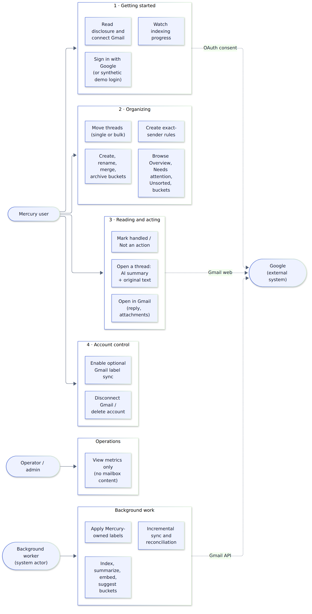
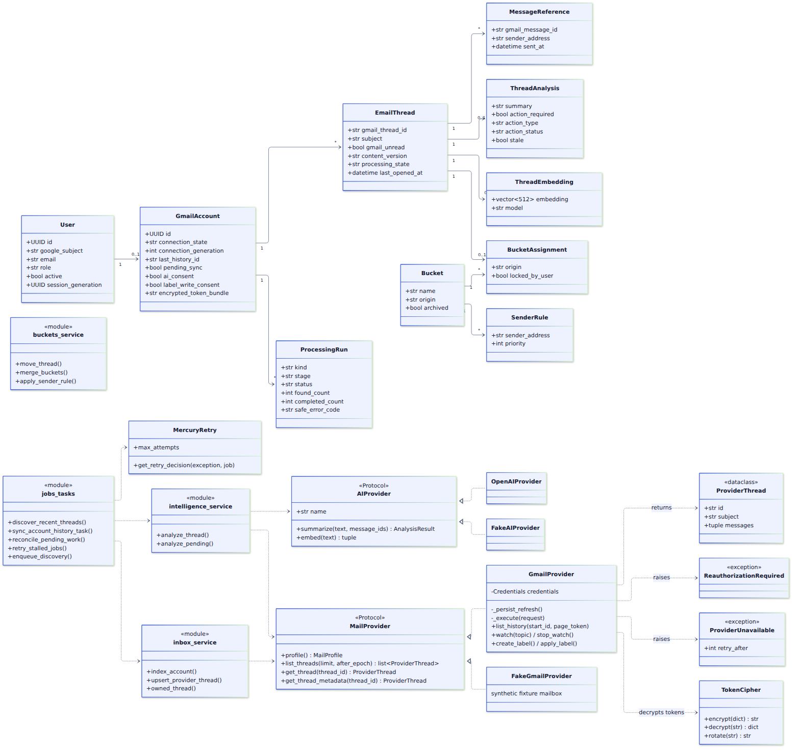
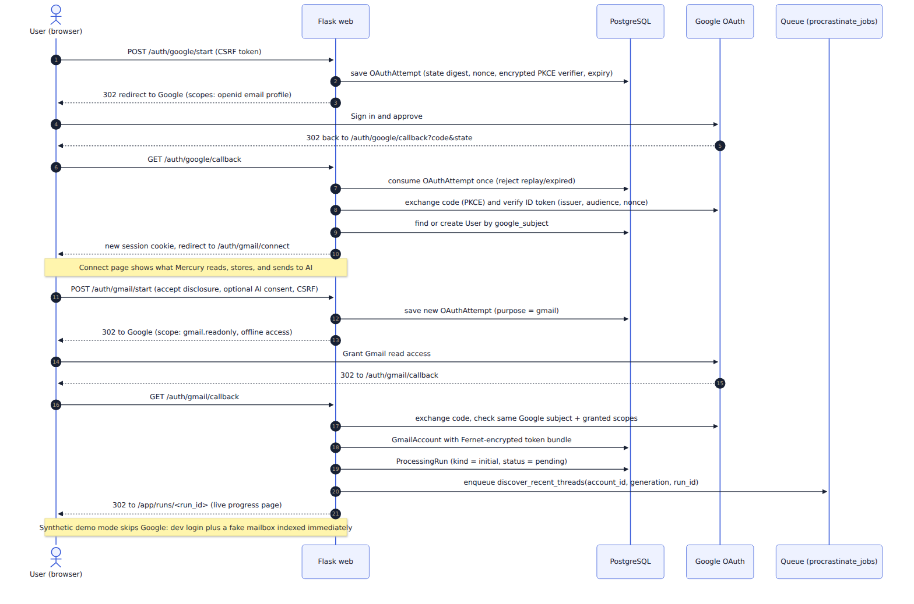
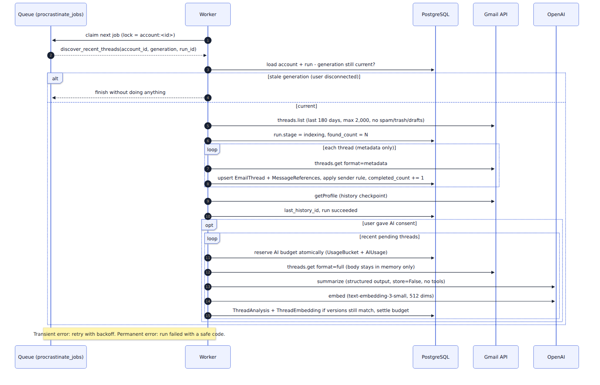
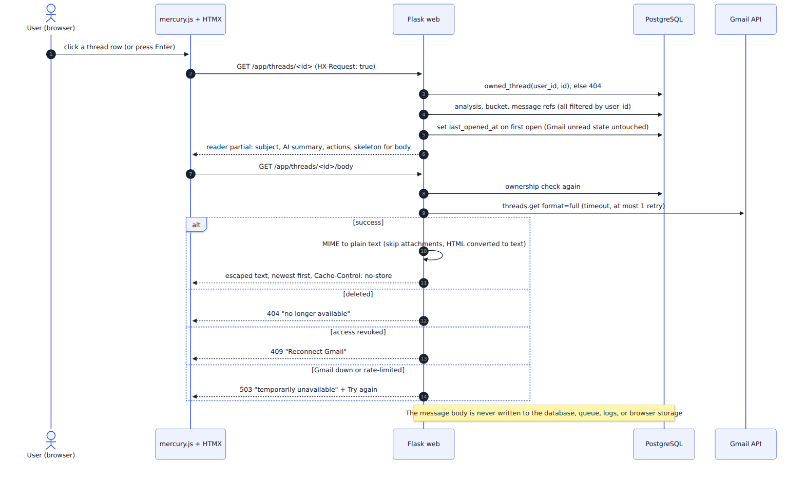
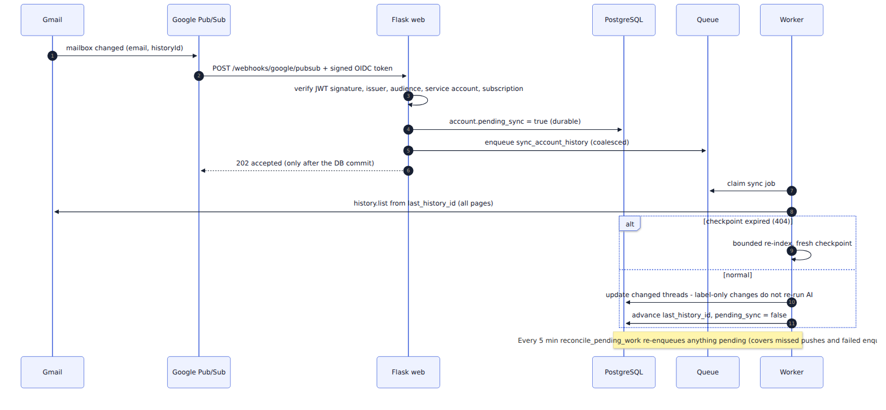

# 4. Diagrams

All diagrams are Mermaid text files in [`diagrams/`](diagrams/), rendered to PNG in
[`images/`](images/).

---

## 4.1 User diagram (who does what)



There are four kinds of actors:

- **Mercury user.** The person whose inbox is organized. Their journey has four stages:
  1. **Getting started:** sign in, read the disclosure, connect Gmail, watch progress.
  2. **Organizing:** browse views, move threads, manage buckets and sender rules.
  3. **Reading and acting:** open a thread (AI summary plus original text), mark it handled, or
     jump to Gmail to reply.
  4. **Account control:** optional label sync, disconnect, or delete.
- **Operator / admin.** Sees only counts and run statuses. By design there's no way for an admin
  to read anyone's mail.
- **Background worker.** Not a person, but it acts on its own schedule: indexing, AI analysis,
  sync, and label writes.
- **Google.** External system: the consent screens, the Gmail web UI you're sent to for
  replies/attachments, and the Gmail API.

---

## 4.2 Entity-relationship (database) diagram


Read the connectors as "one-to-many" (`||--o{`) or "one-to-zero-or-one" (`||--o|`):

- A **user** has at most one **Gmail account**.
- A Gmail account has many **email threads**. Each thread has many **message references**, at
  most one **analysis**, at most one **embedding**, and at most one **bucket assignment**.
- A **bucket** holds many assignments, can be the target of many **sender rules**, and can have
  one **Gmail label mapping**.
- **Processing runs** belong to a Gmail account; **usage buckets** and **ai_usage** track AI
  spending per user (plus global counters).
- **security_audit_events** deliberately has no foreign keys: it must survive the deletion of the
  user it describes, so deletions can be replayed after a backup restore.

Field-by-field details are in [03-database-tables.md](03-database-tables.md).

---

## 4.3 Class diagram (main Python classes and modules)



What to notice:

- **Left side: SQLAlchemy models** (a subset of fields shown), with the same relationships as the
  ER diagram.
- **Provider interfaces (Protocols).** `MailProvider` and `AIProvider` are contracts. Each has a
  real implementation (`GmailProvider`, `OpenAIProvider`) and a fake one (`FakeGmailProvider`,
  `FakeAIProvider`). `create_app()` chooses between them from configuration, so services never
  know or care which one they got. That's how the demo and the tests run offline with the exact
  same service code as production.
- **`ProviderThread`** is a plain data class. The Gmail adapter converts Google's raw JSON into it,
  so no Google response dictionaries leak into the rest of the app.
- **Typed errors.** `ReauthorizationRequired` (the user must reconnect) and `ProviderUnavailable`
  (temporary; retry later) let the reader and the worker react correctly without inspecting
  provider error text.
- **`TokenCipher`** encrypts and decrypts the Google token bundle and supports key rotation.
- **Modules shown as classes** (`inbox_service`, `intelligence_service`, `buckets_service`,
  `jobs_tasks`) are really files of plain functions. The spec prefers simple functions over layers
  of abstraction.
- **`MercuryRetry`** decides whether and when a failed job is retried (chapter 8).

---

## 4.4 Sequence diagram: sign in and connect Gmail



Step by step:

1. **Steps 1–3:** clicking "Sign in with Google" posts a form (with a CSRF token). Mercury saves
   an `OAuthAttempt` containing a hashed random `state`, a `nonce`, and an encrypted PKCE verifier,
   then redirects you to Google asking only for `openid email profile`.
2. **Steps 4–10:** Google redirects back with a one-time `code`. Mercury consumes the attempt
   exactly once (rejecting expired or replayed ones), exchanges the code, verifies the signed ID
   token, finds or creates your `User` by Google subject, and starts a fresh session.
3. **Connect page:** before asking for Gmail access, Mercury explains what it reads, stores, and
   sends to AI. AI processing is a separate, optional checkbox.
4. **Steps 11–20:** a second OAuth round asks for `gmail.readonly` with offline access (so the
   worker can sync later). Mercury checks it's the **same Google account** and which scopes were
   actually granted, encrypts the tokens, and stores the `GmailAccount`.
5. **Steps 21–23:** instead of indexing inside the web request (which could take minutes),
   Mercury creates a `ProcessingRun`, queues a `discover_recent_threads` job, and sends you to the
   live progress page.

In synthetic demo mode the Google steps are skipped: the demo login creates the demo user, and the
fake mailbox (8 invented threads) is indexed immediately so the demo is instantly usable.

---

## 4.5 Sequence diagram: background indexing and AI analysis



1. The worker claims the job. The job's **lock** (`account:<id>`) guarantees only one job per
   account runs at a time.
2. It checks the **connection generation**. If you disconnected after the job was queued, the
   numbers differ and the job exits without touching anything.
3. It lists recent threads (last 180 days, max 2,000, excluding spam, trash, and drafts), then
   fetches **metadata only** for each, upserting `email_threads` and `message_references`. The
   run's `completed_count` goes up as it goes, which is what the progress bar shows.
4. It saves Gmail's current history ID as the checkpoint for future incremental syncs.
5. **If you consented to AI:** for recent pending threads it first **reserves budget** atomically.
   If the cap is reached, the thread is marked `budget_paused` and no call is made. It then fetches
   the full thread (the body stays in memory only), asks OpenAI for a structured summary
   (`store=False`, no tools), and gets a 512-number embedding. Results are saved **only if** the
   connection generation and content version are unchanged; otherwise the reservation is
   cancelled as `stale`.
6. Any failure is handled by the retry policy: temporary problems retry with backoff; permanent
   ones mark the run `failed` with a safe code.

---

## 4.6 Sequence diagram: opening a message (the reader)



1. Clicking a row (or pressing Enter) makes HTMX request the reader **fragment**. The
   `HX-Request` header only chooses a smaller template; it never grants access.
2. Mercury checks you own the thread, loads the summary, bucket, and message references (all
   filtered by your `user_id`), and records `last_opened_at` the first time. Gmail's unread state
   is **not** changed.
3. The fragment shows the subject, AI summary, and action buttons immediately, plus a loading
   skeleton for the body.
4. HTMX then requests `/body`. Mercury re-checks ownership and fetches the thread from Gmail (with a
   timeout and at most one retry). It converts MIME to plain text (skipping attachments; HTML is
   converted to text, never rendered) and returns escaped text with `Cache-Control: no-store`.
5. Failures get honest states: **404** deleted, **409** reconnect needed, **503** Gmail
   unavailable or rate-limited (with a Try again button). The saved AI summary stays visible but is
   never presented as the original.

---

## 4.7 Sequence diagram: Gmail push notification and incremental sync



1. Gmail tells Pub/Sub the mailbox changed. Pub/Sub POSTs to Mercury's webhook with a
   **Google-signed token**.
2. Mercury verifies the signature, issuer, audience, service-account email, and subscription name.
   This endpoint has no CSRF token; the signature check replaces it.
3. It sets `pending_sync = true` and commits **before** replying `202`. If the database were down,
   Pub/Sub would get an error and redeliver, so notifications aren't lost.
4. The worker reads Gmail **history** from `last_history_id`, page by page, updates only the
   changed threads, and advances the checkpoint only after everything is committed. Label-only
   changes don't trigger new AI calls because the content version doesn't change.
5. If the checkpoint is too old (Gmail returns 404), it does a bounded re-index and starts a fresh
   checkpoint.
6. Every 5 minutes a reconciler re-queues anything still pending. This covers missed pushes and the
   rare case where the database commit succeeded but queuing the job failed.

---

## 4.8 Processing-run states


A run is what the progress page shows. It always ends in `succeeded` or `failed`, so the UI never
spins forever. Chapter 8 explains the retry and recovery rules behind each arrow.

---

## 4.9 Docker and frontend diagrams

These are explained in [05-docker-explained.md](05-docker-explained.md) and
[07-frontend-explained.md](07-frontend-explained.md).

---

## How to re-render the diagrams

The images were produced with Mermaid CLI:

```bash
# one-time: install the renderer (any folder outside the repo)
npm i @mermaid-js/mermaid-cli
# render one diagram (repeat per file)
npx mmdc -i first_iter/diagrams/er-diagram.mmd -o first_iter/images/er-diagram.png -b white -s 2
```

VS Code (with a Mermaid extension) and GitHub can also preview the `.mmd` text directly.
