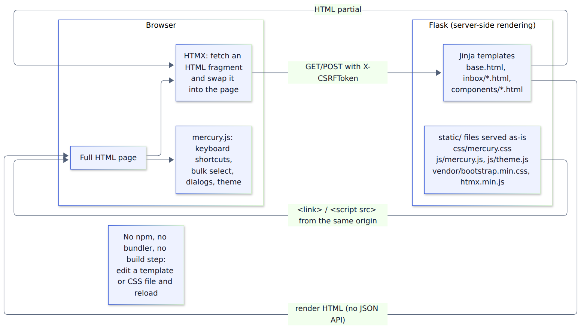

# 7. The frontend, explained

## Two common ways to build a web UI

**A. Single-page application (SPA), e.g. React.** The server sends a nearly empty HTML page plus
a large JavaScript bundle. The JavaScript builds the whole UI in the browser and fetches **JSON**
from an API. This needs Node.js, npm packages, a bundler (Vite/Webpack), a build step
(`npm run build`), usually a second deployment, and a way to share login state between frontend
and API.

**B. Server-rendered HTML (what Mercury uses).** The server builds complete **HTML** pages from
templates and sends them ready to display. Interactivity is added in small pieces.

Mercury uses **B, with HTMX** for app-like partial updates. The spec chose this on purpose:

- **One origin, one deployment, one login system.** No separate frontend host, no CORS, no token
  juggling.
- **Security.** Jinja auto-escapes every value, so an email containing `<script>` shows up as text
  and never runs. The strict Content-Security-Policy only allows scripts and styles from Mercury's
  own server.
- **Less to maintain.** No Node toolchain, no bundle builds, and business logic stays in Python.
- **Room to grow.** Routes stay thin and logic lives in services, so a richer frontend could be
  added later without rewriting the backend.

## How a Mercury page is produced

1. A route calls `render_template("inbox/workspace.html", ...)`.
2. **Jinja** fills in the template: it extends `base.html` (header, navigation, toasts, script
   tags) and uses reusable **macros** from `templates/components/` (badges, empty states, icons,
   buttons).
3. The browser receives finished HTML and loads a few static files from the same server:
   `vendor/bootstrap.min.css`, `css/mercury.css`, `vendor/htmx.min.js`, `js/theme.js`,
   `js/mercury.js`.

### What HTMX does

HTMX lets HTML attributes make requests and swap the returned **HTML fragment** into the page.
For example, clicking a thread row runs `GET /app/threads/<id>` with the header
`HX-Request: true`. The server sees that header and returns `inbox/_reader_panel.html` (just the
reader) instead of the full page, and HTMX places it in the right-hand panel. The same route
without HTMX returns the full `reader.html` page. So:

- **Everything works without JavaScript.** Links and forms are real links and forms; HTMX only
  upgrades them.
- **`HX-Request` never grants access.** Ownership is checked the same way either way.
- Safety settings in `base.html`: `allowEval=false`, `allowScriptTags=false`,
  `historyCacheSize=0` (no copies of pages kept in browser history), `selfRequestsOnly=true`, and
  `hx-history="false"`.

### What `mercury.js` does (about 530 lines of plain JavaScript)

Using event delegation (listening at the document level), it adds:
- the **CSRF header** (`X-CSRFToken`) to every HTMX request
- **toasts** (auto-dismissing messages that pause on hover or focus)
- **keyboard shortcuts:** `j`/`k` or arrows to move, `Enter`/`o` to open, `x` to select, `m` to
  move, `/` to filter, `Esc` to close, `?` for help
- **bulk select** with a confirmation dialog showing how many threads will move
- **client-side filtering** of the rows already on the page (no server search)
- **confirmation dialogs** for disconnect and archive (native `<dialog>`)
- **reader loading and error handling:** skeletons while loading, error states with Try again, and
  the reader opening in the side panel on wide screens (≥1100px) or as a full page on phones
- the **theme toggle** (light/dark), stored in `localStorage` as just `"light"` or `"dark"`

`theme.js` is a tiny script that applies the saved theme before the page paints, which avoids a
flash of the wrong theme. It's a separate file because inline scripts are blocked by the CSP.

**Rule:** no email content, subjects, or summaries are ever stored in the browser. The only stored
values are the theme and a temporary "moved N threads" notice.

### The design system ("Quicksilver")

`static/css/mercury.css` (loaded after Bootstrap) defines:
- **Color tokens** as CSS variables (`--ink`, `--muted`, `--surface`, `--canvas`, `--border`,
  `--accent: #3659D9`, plus a silver gradient family and success/warning/danger tones), redefined
  for dark mode
- the three-column workspace (sidebar, thread list, reader) collapsing to one column on phones
- badges that always pair color with text and an icon, e.g. "Unread in Gmail" vs "New in Mercury"
- shimmer skeletons and subtle motion, all disabled when the OS asks for reduced motion
- the brand mark (a silver planet with a blue orbit and motion lines), stored as
  `static/img/mercury-mark.svg` and as an inline SVG macro in `components/brand.html`

Only system fonts are used (no Google Fonts or other external requests).

## "How do we build the frontend?"

**There is no frontend build.** The files in `mercury/static/` are served exactly as written:

| File(s) | Where they come from |
|---|---|
| `static/vendor/bootstrap.min.css`, `bootstrap.bundle.min.js`, `htmx.min.js` | Pinned releases (Bootstrap 5.3.8, HTMX 2.0.11), downloaded by `scripts/fetch_vendor_assets.py` with SHA-384 verification, **checked into Git** |
| `static/css/mercury.css`, `static/js/*.js`, `static/img/*` | Hand-written, edited directly |
| `templates/**/*.html` | Jinja templates rendered by Flask on each request |

Why vendor the libraries instead of using a CDN? The CSP forbids third-party scripts, there's no
dependency on an outside service at runtime, and the hash check guarantees the files are the
genuine releases. The Docker build fetches and verifies them again and always ships the verified
copies.

## How to change the UI

1. Start the host-Python workflow (chapter 6) so Flask reloads automatically:
   `poetry run flask --app wsgi:app run --port 5001 --debug`.
2. Edit a template in `mercury/templates/…` or styles in `mercury/static/css/mercury.css`.
3. Refresh the browser. (Hard-refresh with Ctrl+Shift+R if CSS looks cached.)
4. Run the UI tests: `tests/acceptance/test_ui_partials.py` (in `make test`) and optionally
   `make browser-test`.
5. Rebuild the image (`make demo`) to see it in the containers.

**Rules that tests and the CSP enforce:**
- Never use `|safe`, `Markup`, or `` on anything derived from mail, AI output,
  or user input.
- No `<script>` blocks, `<style>` blocks, `style="..."` attributes, `hx-on`, or `javascript:`
  links. Put behavior in `mercury.js` and styling in `mercury.css`.
- Every form that changes something needs `{{ form.hidden_tag() }}` or a `csrf_token` hidden field.
- Status must never be shown by color alone; always add text or an icon.

## Template map

| Template | Page |
|---|---|
| `base.html` | Shared layout: header, nav, toasts, assets, CSP-safe config |
| `public/index.html`, `privacy.html`, `terms.html`, `help.html` | Public pages |
| `accounts/dev_login.html`, `connect.html`, `settings.html` | Demo login, Gmail disclosure/connect, settings |
| `inbox/workspace.html` + `_thread_row.html` | Three-column workspace and one list row |
| `inbox/reader.html`, `_reader.html`, `_reader_panel.html` | Full reader page / shared reader body / HTMX panel |
| `inbox/body.html`, `body_error.html` | Original text, or the deleted/reconnect/unavailable states |
| `inbox/progress.html`, `_progress.html` | Indexing progress (polls while running) |
| `buckets/edit.html`, `merge.html`, `rules.html` | Bucket create/rename/archive, merge preview, sender rules |
| `components/*.html` | Macros: icons, brand, badges/states, toasts |
| `errors/error.html`, `admin/index.html` | Safe error page; metrics-only admin |
